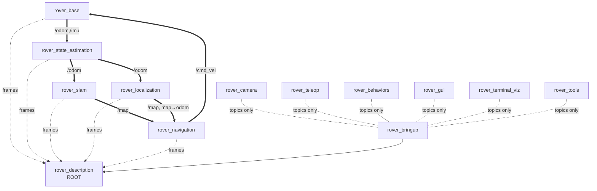

# Design: Modular `rover_*` Architecture (so101-style)

**Date:** 2026-05-20
**Status:** Approved (design) — pending spec review before implementation plan
**Topic:** Re-modularize the Advanced_Robo_Project SLAM workspace into clean,
single-responsibility ROS 2 packages, mirroring the architecture documented in
`vla_SO-ARM101/docs/MODULARITY.md`.

---

## 1. Context & intent

`ros2_ws/src` is a working SLAM mobile-rover stack, but it is organized by
*homework / author* (`mal_hw3_pkg`, `mal_planner`, `main_mal_launch`) rather than
by *responsibility*. First-party code, vendored third-party drivers, and dev
scripts are visually mixed; the only robot URDF is buried inside a vendored
submodule; planning, path-following, map I/O, calibration, debug, and launch
files are all jammed into one `mal_planner` "god-package."

The reference stack (`vla_SO-ARM101`) is the opposite: highly modular at the
package and system level — 7 single-responsibility packages, an acyclic
dependency graph rooted on a `description` package, and a **swappable backend
behind a fixed topic contract**. This project already has the clean topic
contract (`/scan`, `/odom`, `/imu`, `/cmd_vel`, `/goal_pose`, `/plan`, `/map`);
it just needs the packages re-cut to match.

This design re-cuts the workspace into **13 first-party `rover_*` packages plus a
`src/vendor/` area**, preserving on-wire behavior.

## 2. Goals & non-goals

**Goals**
- Responsibility-aligned packages: each describable in one sentence with no "and."
- A first-party `rover_description` package as the dependency root (the URDF).
- Isolate all third-party code under `src/vendor/`.
- Consistent `rover_` naming.
- An acyclic dependency graph; leaf packages couple only via runtime topics.
- A top-level `rover_bringup` with layered launch composition and a
  `backend:=real|sim|bag` switch.
- Behavior-preserving "tidy" fixes: dedupe configs, relocate misplaced code,
  separate dev tools from runtime, fix dependency/metadata hygiene.

**Non-goals (explicitly out of scope for this work)**
- No node *logic* rewrites. Topics, message types, parameters, and on-wire
  behavior stay identical. (No shared follower base class, no god-file splits of
  node internals — those are deferred.)
- No changes to vendored package internals.
- No new features.
- This work does not itself require on-hardware re-validation, because behavior
  is preserved; a hardware smoke test is recommended but not part of acceptance.

## 3. Current state (inventory)

**First-party packages (to be re-cut):** `color_follower`, `line_follower`,
`main_mal_launch`, `mal_hw3_pkg`, `mal_planner` (cmake), `my_gui_pkg`,
`robo_realsense`, `robo_rover` (cmake), `robo_teleop`, `terminal_rviz` (cmake,
**first-party** — bespoke terminal visualizer).

**Vendored / third-party (to be moved to `src/vendor/`, internals untouched):**
`slam_toolbox`, `rplidar_ros`, `rf2o_laser_odometry`, `autonomous-robot`
(a submodule bundling `robot-nav` [URDF + nav], `bno085_ros2_driver`
[`imu_data_publisher` → `/imu`], `pwm_node` [motor PWM], `tf2_web_publisher`).

**Known issues this design fixes:**
- Two `ekf.yaml` (in `main_mal_launch/config` and `robo_rover/Config`).
- `loop_closure_detector.py` (actually a lap/course-completion behavior, not
  SLAM loop closure) misfiled in `line_follower`.
- Dev/calibration scripts (`fake_odom`, `calibrate_velocity`, `debug_vel`,
  `imu_calib_values`, `desktop_stream`) registered as / mixed with runtime nodes.
- Empty `<maintainer>` fields and `TODO: Package description` in several
  `package.xml` files.
- No first-party robot description; URDF lives only in a vendored submodule.

## 4. Target package architecture

13 first-party packages. Build type is normalized to `ament_python` for
python-node packages and `ament_cmake` only where required (URDF install, C++).

| Package | Build | Responsibility (one sentence) | Sourced from | Entry points (target) |
|---|---|---|---|---|
| **`rover_description`** | cmake | The robot's URDF/xacro, meshes, and `robot_state_publisher` | copy of `autonomous-robot/src/robot-nav/description` | (launch only) |
| **`rover_base`** | python | Drives the physical base: `/cmd_vel` → motors, publishes `/odom` + raw `/imu` | `robo_rover` | `rover_node`, `velocity_controller` |
| **`rover_camera`** | python | Publishes the RealSense color stream | `robo_realsense/ros_stream.py` | `ros_stream` |
| **`rover_state_estimation`** | python | Fuses laser-odometry + IMU into one `/odom` (rf2o include + robot_localization EKF) | `robo_rover`/`main_mal_launch` ekf configs + rf2o include | (launch + config only) |
| **`rover_slam`** | python | Builds a live map with slam_toolbox (online async/sync) | `mal_planner` slam launches + slam_toolbox configs | (launch + config only) |
| **`rover_localization`** | python | Localizes on a saved map (amcl + slam_toolbox localization + map_server) | `mal_planner` (save_map, amcl.yaml, maps/) | `save_map` |
| **`rover_navigation`** | python | Plans a path to a goal and follows it (`/goal_pose`→`/plan`→`/cmd_vel`) | `mal_planner` (astar_planner, pure_pursuit, goal_pub) | `astar_planner`, `pure_pursuit`, `goal_pub` |
| **`rover_teleop`** | python | Turns human input into `/cmd_vel` | `robo_teleop` | `keyboard_teleop`, `joystick_teleop` |
| **`rover_behaviors`** | python | Reactive autonomy producing `/cmd_vel` | `line_follower` + `color_follower` + `mal_hw3_pkg` + auto_lidar | `line_follower`, `color_follower`, `stall_detector`, `lap_monitor`, `wall_stop`, `wall_follow_pid`, `auto_lidar` |
| **`rover_gui`** | python | Operator GUI | `my_gui_pkg` | `gui_node` |
| **`rover_terminal_viz`** | cmake | Terminal-based visualizer (first-party) | `terminal_rviz` (renamed) | `terminal_rviz_node` (node name unchanged) |
| **`rover_tools`** | python | Dev/calibration/debug utilities (not runtime) | scattered scripts | `fake_odom`, `calibrate_velocity`, `debug_vel`, `imu_calib`, `desktop_stream` |
| **`rover_bringup`** | python | Top-level layered launch composition + backend switch | `main_mal_launch` + composed `mal_planner` launches | (launch only) |

Plus **`src/vendor/`**: `slam_toolbox`, `rplidar_ros`, `rf2o_laser_odometry`,
`autonomous-robot` (moved verbatim; still build via colcon's recursive scan).

### File-move map (notable relocations)

- `line_follower/follower_node.py` → `rover_behaviors` (module `line_follower.py`)
- `color_follower/follower_node.py` → `rover_behaviors` (module `color_follower.py`)
- `line_follower/loop_closure_detector.py` (`LoopClosureMonitor`) → `rover_behaviors` as `lap_monitor` **(relocated; misleading name)**
- `line_follower/stall_detector.py` → `rover_behaviors`
- `mal_hw3_pkg/lidar_wall_stop.py` → `rover_behaviors` (`wall_stop`)
- `mal_hw3_pkg/pid_control_node.py` → `rover_behaviors` (`wall_follow_pid`)
- `robo_rover/auto_lidar_node.py` → `rover_behaviors` (`auto_lidar`)
- `robo_rover/imu_calib_values.py` → `rover_tools` (`imu_calib`)
- `mal_planner/scripts/{fake_odom,calibrate_velocity,debug_vel}.py` → `rover_tools`
- `robo_realsense/desktop_stream.py` → `rover_tools` (`desktop_stream`)
- `mal_planner/scripts/save_map.py` + `maps/` + `config/amcl.yaml` → `rover_localization`
- `mal_planner` slam launches + slam_toolbox mapper params → `rover_slam`
- `mal_planner/scripts/{astar_planner,pure_pursuit,goal_pub}.py` → `rover_navigation`
- two `ekf.yaml` → single canonical `rover_state_estimation/config/ekf.yaml`
- `terminal_rviz` → `rover_terminal_viz` (package rename; the C++ node name
  `terminal_rviz_node` is preserved)

> Note: `rover_behaviors` will contain two modules formerly both named
> `follower_node.py`; they are renamed to `line_follower.py` / `color_follower.py`
> on move (rename only — no logic change) so entry points are unambiguous.

## 5. Dependency graph (acyclic, rooted on description)

- **`rover_description` is the single root.** Physical packages depend on it for
  frames (an `exec_depend` for xacro / `robot_state_publisher`, not a build cycle).
- **Leaf data-source / consumer packages carry zero first-party build deps**
  (`rover_base`, `rover_camera`, `rover_teleop`, `rover_behaviors`, `rover_gui`,
  `rover_terminal_viz`, `rover_tools`): they couple to the system only through ROS
  topics at runtime, so each builds, tests, and runs in isolation.
- **`rover_slam` (mapping) and `rover_localization` (on a saved map) do not
  depend on each other** — `save_map` consumes the `/map` *topic*, so the
  producer/consumer relationship never becomes a build edge.
- `rover_bringup` sits at the top; it `exec_depend`s on the packages whose
  launch files it includes. Double arrows (`==>`) are runtime topic flows, not
  build dependencies.

## 6. Interface contracts — the swappable backend (crown jewel)

The SLAM / navigation / behavior core consumes a fixed set of topics and never
needs to know what produces them. `rover_bringup` exposes `backend:=`:

| Contract topic | `backend:=real` | `backend:=sim` | `backend:=bag` |
|---|---|---|---|
| `/scan` | `rplidar_ros` (vendor) | Gazebo + `lidar.xacro` | bag playback |
| `/odom` (raw), `/imu` | `rover_base` + `bno085_ros2_driver` (vendor) | `gazebo_control.xacro` + ros2_control | bag playback |
| `/camera/color/image_raw` | `rover_camera` | Gazebo camera plugin | bag playback |
| `/cmd_vel` (consumed) | `rover_base` → `pwm_node` (vendor) | Gazebo diff-drive | (ignored) |

`/odom` (fused) ← `rover_state_estimation`; `/map` + `map→odom` tf ← `rover_slam`
(mapping mode) **or** `rover_localization` (on a saved map); `/plan` ←
`rover_navigation`. The `sim` backend is genuinely reachable because
`gazebo_control.xacro` and `ros2_control.xacro` already exist in the vendored
description and are copied into `rover_description`.

## 7. Launch composition (target)

Layered via `IncludeLaunchDescription`, parameterized by arguments rather than
forked files. Target launch files in `rover_bringup`:

- `backend.launch.py` — selects real / sim / bag sensor+actuator sources.
- `rover.launch.py` — top-level (was `mal_startup.launch.py`); includes
  `backend.launch.py` + `rover_description` (robot_state_publisher) +
  `rover_state_estimation` + chosen mode.
- `slam.launch.py` — mapping mode (includes `rover_slam`).
- `slam_nav.launch.py` — mapping + navigation (includes `rover_navigation`).
- `odom_nav.launch.py` — navigation on odom only.
- `localization.launch.py` — localize on a saved map (includes
  `rover_localization`: slam_toolbox localization / amcl + map_server).

Subsystem-local launch files live in their owning package
(`rover_slam/launch/`, `rover_localization/launch/`, `rover_navigation/launch/`,
etc.); `rover_bringup` includes them. All `get_package_share_directory` /
`FindPackageShare` references and any hard-coded map/config paths are updated to
the new package names as part of migration.

## 8. Migration strategy (build stays green throughout)

Phased; `colcon build` is run and must pass after each phase.

1. **Vendor isolation.** Create `src/vendor/`; `git mv` the four third-party
   packages into it. Build + verify (colcon scans recursively).
2. **Description root.** Create `rover_description`; copy URDF/xacro/meshes from
   the vendored `robot-nav/description`; add a `robot_state_publisher` launch.
   Build + verify.
3. **Leaf packages first** (no first-party deps): `rover_camera`, `rover_teleop`,
   `rover_gui`, `rover_tools`, `rover_behaviors`, `rover_base`. For each: create
   package skeleton, `git mv` modules in, write `package.xml`/`setup.py` with
   correct deps + entry points, build + verify, then remove the emptied source
   package.
4. **Estimation / SLAM / localization / navigation:** `rover_state_estimation`
   (dedupe ekf), `rover_slam` (online mapping launches + params),
   `rover_localization` (amcl + map_server + `save_map` + `maps/`),
   `rover_navigation` (planner + pursuit + goal). Update internal launch/config/
   path references. Build + verify each.
5. **Bringup last:** `rover_bringup` with layered launches + `backend.launch.py`;
   repoint all includes to new package names. Build + verify.
6. **Tidy pass:** fill maintainers/descriptions, prune dead deps, delete the
   now-empty legacy packages, update root `README.md` + add a `CLAUDE.md`
   documenting the package table.

Old and new package names differ, so legacy and new can briefly coexist;
duplicate console-script names are avoided by migrating one subsystem at a time
and deleting the source package immediately after its content moves.

## 9. Risks & mitigations

- **Launch/config path breakage** — the bulk of the wiring risk. Mitigation:
  grep every `get_package_share_directory`, `FindPackageShare`, and hard-coded
  `maps/`/`config/` path; update on move; build-verify per phase.
- **`rover_base` vs `pwm_node` actuator overlap** — preserve the *current*
  real-backend wiring exactly as `mal_startup.launch.py` has it; do not
  rationalize the hardware path during repackaging.
- **`ament_cmake` → `ament_python` build-type changes** (rover_base,
  rover_navigation, rover_slam, rover_localization) — these install python
  nodes; verify entry points resolve (`ros2 run <pkg> <exe>`) after each
  conversion.
- **Vendored submodule (`autonomous-robot`) move** — use `git mv`; confirm the
  submodule pointer/`.gitmodules` path is updated so the submodule still resolves.
- **`terminal_rviz` → `rover_terminal_viz` C++ rename** — touches `package.xml`
  `<name>`, CMake `project()`, the `include/terminal_rviz/` directory, `#include`
  paths, and `install()` rules. Mechanical but build-breaking if partial; verify
  the package builds and `terminal_rviz_node` still runs after rename.

## 10. Success criteria (acceptance)

1. `colcon build` succeeds from a clean workspace.
2. All 13 first-party packages exist with non-empty maintainers/descriptions and
   correct dependency declarations; third-party packages all live under
   `src/vendor/`.
3. `rover_description` is the first-party URDF root and produces a robot model
   (`robot_state_publisher` + rviz check).
4. Every legacy package (`mal_*`, `robo_*`, `*_follower`, `my_gui_pkg`,
   `main_mal_launch`) is gone, `terminal_rviz` is renamed to `rover_terminal_viz`,
   and there is no duplicate `ekf.yaml`.
5. Each runtime entry point in the table resolves via `ros2 run`.
6. `ros2 launch rover_bringup rover.launch.py backend:=real` reproduces the node
   graph of the old `mal_startup.launch.py` (same nodes, same topics).
7. A `CLAUDE.md` documents the authoritative package table and the backend
   contract.
